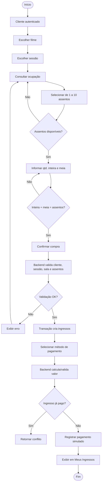
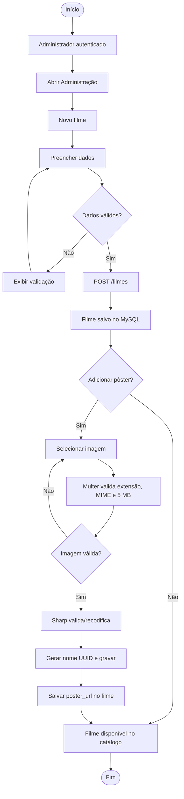

# Diagramas de Atividades — Cinemax

## 1. Atividade — Compra de ingressos

```mermaid
flowchart TD
    A([Início]) --> B[Cliente autenticado]
    B --> C[Escolher filme]
    C --> D[Escolher sessão]
    D --> E[Consultar ocupação]
    E --> F[Selecionar de 1 a 10 assentos]
    F --> G{Assentos disponíveis?}
    G -- Não --> E
    G -- Sim --> H[Informar qtd. inteira e meia]
    H --> I{Inteira + meia = assentos?}
    I -- Não --> H
    I -- Sim --> J[Confirmar compra]
    J --> K[Backend valida cliente, sessão, sala e assentos]
    K --> L{Validação OK?}
    L -- Não --> M[Exibir erro]
    M --> E
    L -- Sim --> N[Transação cria ingressos]
    N --> O[Selecionar método de pagamento]
    O --> P[Backend calcula/valida valor]
    P --> Q{Ingresso já pago?}
    Q -- Sim --> R[Retornar conflito]
    Q -- Não --> S[Registrar pagamento simulado]
    S --> T[Exibir em Meus Ingressos]
    T --> U([Fim])
```

## 2. Atividade — Cadastro de filme e pôster pelo Admin

```mermaid
flowchart TD
    A([Início]) --> B[Administrador autenticado]
    B --> C[Abrir Administração]
    C --> D[Novo filme]
    D --> E[Preencher dados]
    E --> F{Dados válidos?}
    F -- Não --> G[Exibir validação]
    G --> E
    F -- Sim --> H[POST /filmes]
    H --> I[Filme salvo no MySQL]
    I --> J{Adicionar pôster?}
    J -- Não --> N[Filme disponível no catálogo]
    J -- Sim --> K[Selecionar imagem]
    K --> L[Multer valida extensão, MIME e 5 MB]
    L --> M{Imagem válida?}
    M -- Não --> K
    M -- Sim --> O[Sharp valida/recodifica]
    O --> P[Gerar nome UUID e gravar]
    P --> Q[Salvar poster_url no filme]
    Q --> N
    N --> R([Fim])
```
