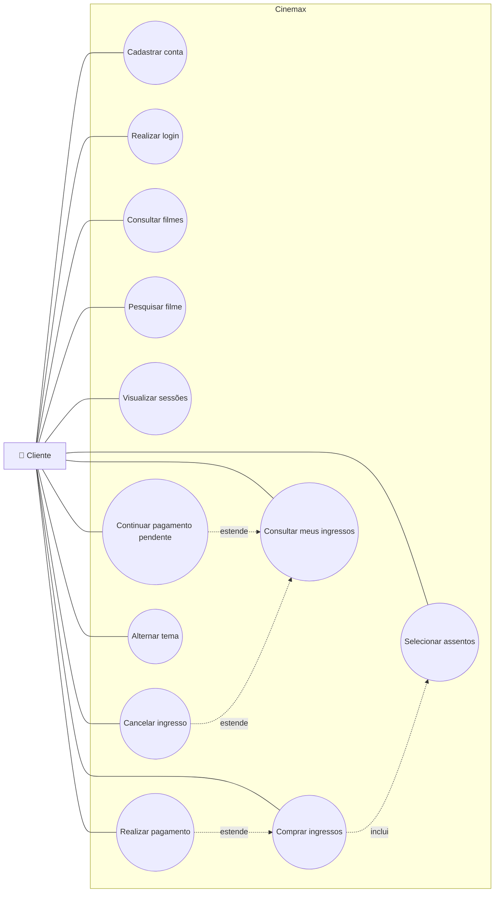
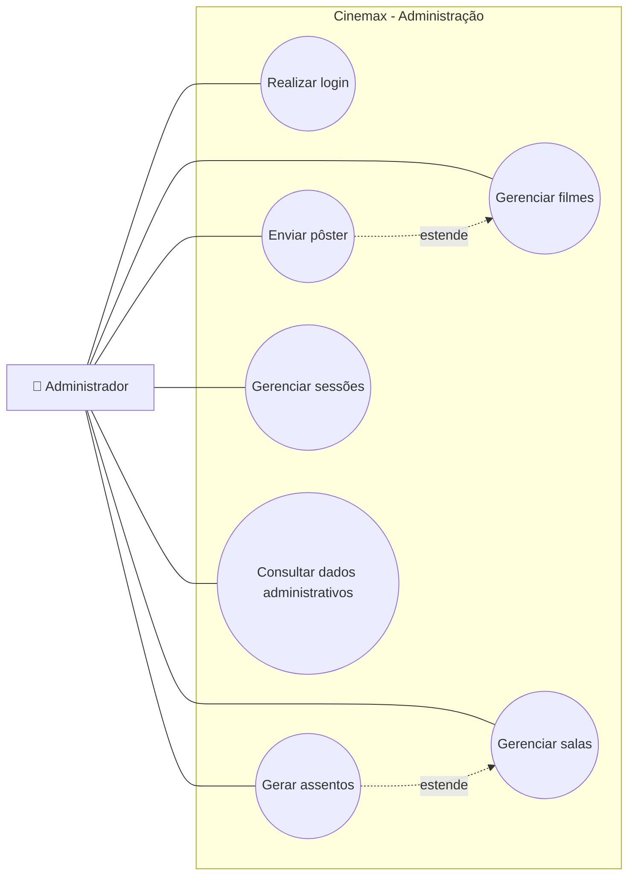

# Diagramas de Casos de Uso — Cinemax

## 1. Caso de Uso — Cliente

### Descrição resumida

O cliente se autentica, consulta o catálogo, escolhe uma sessão e assentos, define inteira/meia, confirma a compra e registra o pagamento. Depois pode consultar os próprios ingressos, retomar pagamento pendente ou cancelar quando permitido.

---

## 2. Caso de Uso — Administrador

### Descrição resumida

O administrador utiliza as mesmas credenciais do sistema, porém seu perfil libera funcionalidades protegidas de administração. A API também verifica o perfil `admin`, portanto a restrição não depende apenas da interface.
