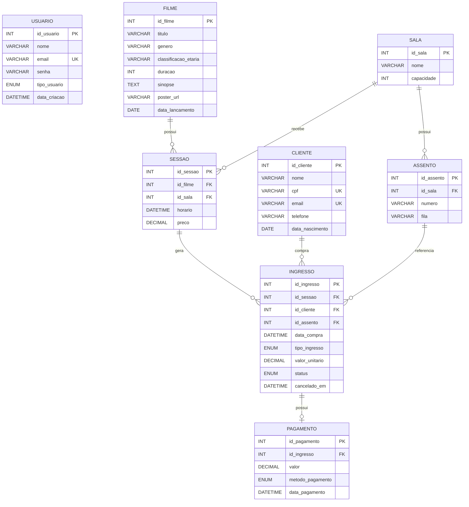

# Diagrama Entidade-Relacionamento — Cinemax

O DER abaixo representa as entidades persistidas do projeto.

## Cardinalidades

- Uma **Sala** possui vários **Assentos**.
- Um **Filme** pode possuir várias **Sessões**.
- Uma **Sala** pode receber várias **Sessões**.
- Uma **Sessão** pode possuir vários **Ingressos**.
- Um **Cliente** pode possuir vários **Ingressos**.
- Um **Assento** pode aparecer em ingressos de sessões diferentes.
- Um **Ingresso** possui zero ou um **Pagamento**.

## Observação importante sobre Usuario e Cliente

`Usuario` e `Cliente` são entidades distintas e **não possuem chave estrangeira direta entre si** no banco atual.

A associação operacional do cliente autenticado é feita pela aplicação utilizando o **e-mail do JWT** para localizar/criar o registro de `Cliente`. Portanto, o DER não apresenta uma FK inexistente entre `usuarios` e `clientes`.

## Restrições de integridade relevantes

- E-mail de usuário é único.
- E-mail de cliente é único.
- CPF de cliente é único.
- `(id_sala, fila, numero)` é único para assentos.
- Um assento ativo não pode ser duplicado na mesma sessão.
- `id_ingresso` é único em pagamentos, impedindo dois pagamentos para o mesmo ingresso.
