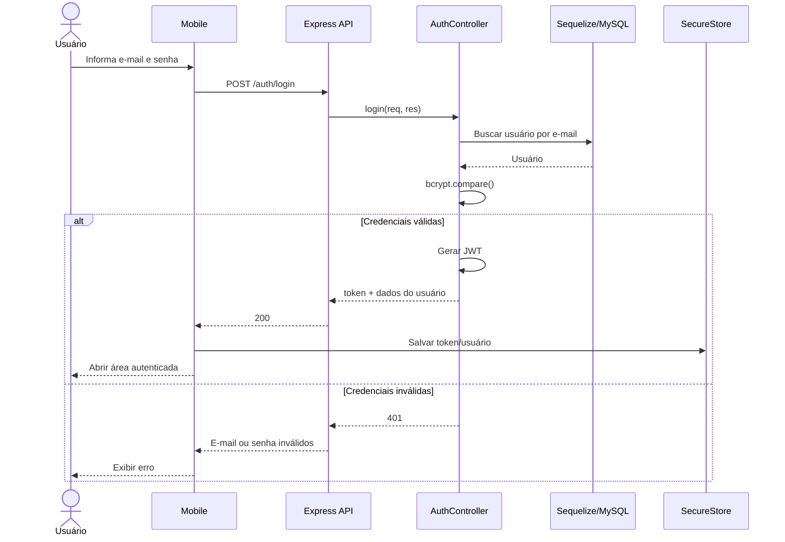
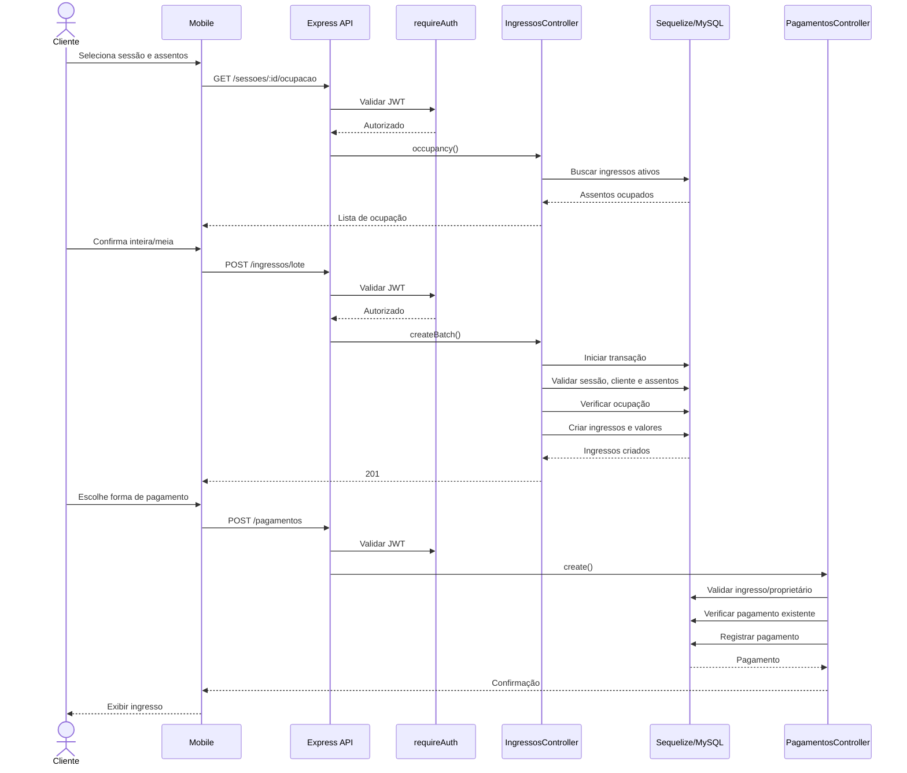
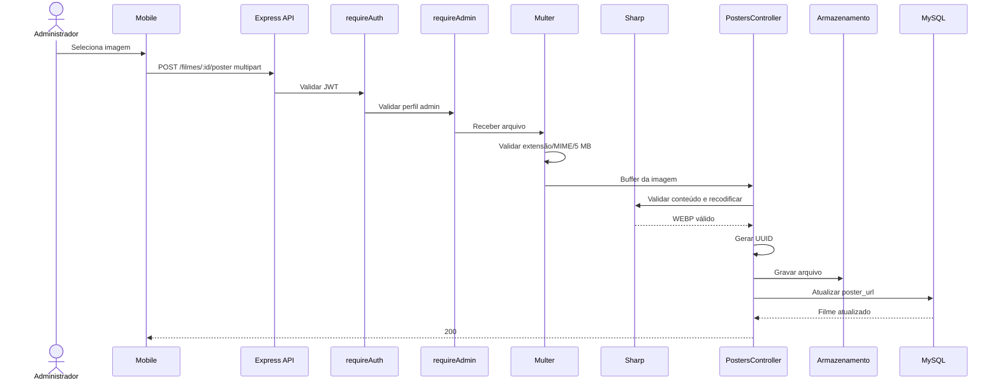

# Diagramas de Sequência — Cinemax

## 1. Sequência — Login

```mermaid
sequenceDiagram
    actor U as Usuário
    participant M as Mobile
    participant API as Express API
    participant AC as AuthController
    participant DB as Sequelize/MySQL
    participant SS as SecureStore

    U->>M: Informa e-mail e senha
    M->>API: POST /auth/login
    API->>AC: login(req, res)
    AC->>DB: Buscar usuário por e-mail
    DB-->>AC: Usuário
    AC->>AC: bcrypt.compare()
    alt Credenciais válidas
        AC->>AC: Gerar JWT
        AC-->>API: token + dados do usuário
        API-->>M: 200
        M->>SS: Salvar token/usuário
        M-->>U: Abrir área autenticada
    else Credenciais inválidas
        AC-->>API: 401
        API-->>M: E-mail ou senha inválidos
        M-->>U: Exibir erro
    end
```

## 2. Sequência — Compra de múltiplos ingressos

```mermaid
sequenceDiagram
    actor C as Cliente
    participant M as Mobile
    participant API as Express API
    participant MW as requireAuth
    participant IC as IngressosController
    participant DB as Sequelize/MySQL
    participant PC as PagamentosController

    C->>M: Seleciona sessão e assentos
    M->>API: GET /sessoes/:id/ocupacao
    API->>MW: Validar JWT
    MW-->>API: Autorizado
    API->>IC: occupancy()
    IC->>DB: Buscar ingressos ativos
    DB-->>IC: Assentos ocupados
    IC-->>M: Lista de ocupação

    C->>M: Confirma inteira/meia
    M->>API: POST /ingressos/lote
    API->>MW: Validar JWT
    MW-->>API: Autorizado
    API->>IC: createBatch()
    IC->>DB: Iniciar transação
    IC->>DB: Validar sessão, cliente e assentos
    IC->>DB: Verificar ocupação
    IC->>DB: Criar ingressos e valores
    DB-->>IC: Ingressos criados
    IC-->>M: 201

    C->>M: Escolhe forma de pagamento
    M->>API: POST /pagamentos
    API->>MW: Validar JWT
    API->>PC: create()
    PC->>DB: Validar ingresso/proprietário
    PC->>DB: Verificar pagamento existente
    PC->>DB: Registrar pagamento
    DB-->>PC: Pagamento
    PC-->>M: Confirmação
    M-->>C: Exibir ingresso
```

## 3. Sequência adicional — Upload de pôster

```mermaid
sequenceDiagram
    actor A as Administrador
    participant M as Mobile
    participant API as Express API
    participant Auth as requireAuth
    participant Adm as requireAdmin
    participant Multer as Multer
    participant Sharp as Sharp
    participant PC as PostersController
    participant FS as Armazenamento
    participant DB as MySQL

    A->>M: Seleciona imagem
    M->>API: POST /filmes/:id/poster multipart
    API->>Auth: Validar JWT
    Auth->>Adm: Validar perfil admin
    Adm->>Multer: Receber arquivo
    Multer->>Multer: Validar extensão/MIME/5 MB
    Multer->>PC: Buffer da imagem
    PC->>Sharp: Validar conteúdo e recodificar
    Sharp-->>PC: WEBP válido
    PC->>PC: Gerar UUID
    PC->>FS: Gravar arquivo
    PC->>DB: Atualizar poster_url
    DB-->>PC: Filme atualizado
    PC-->>M: 200
```
